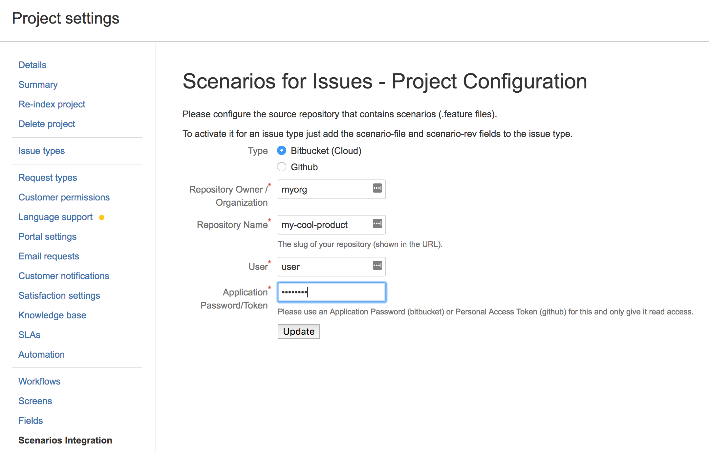
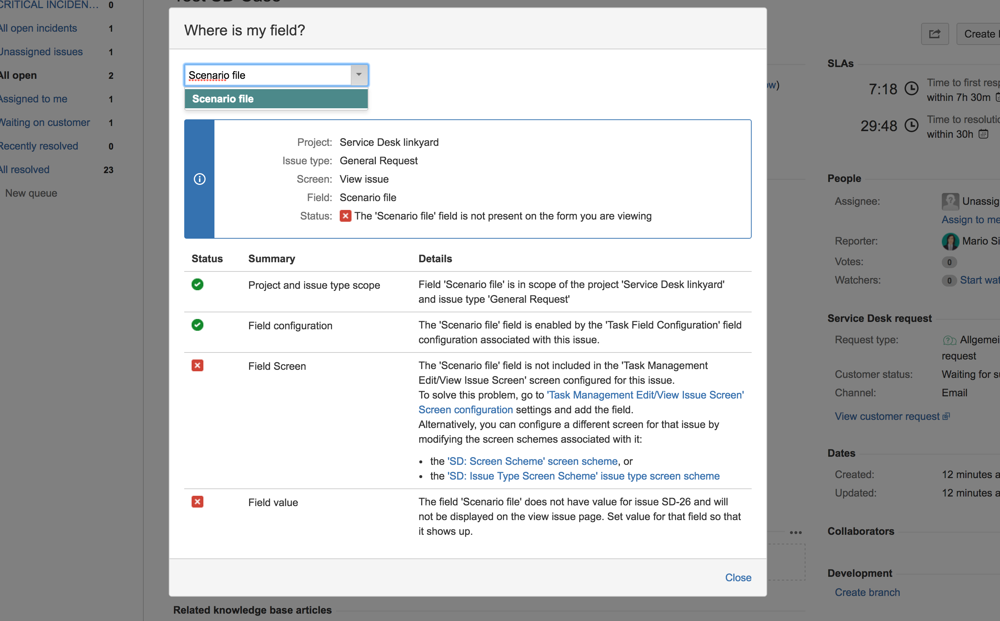
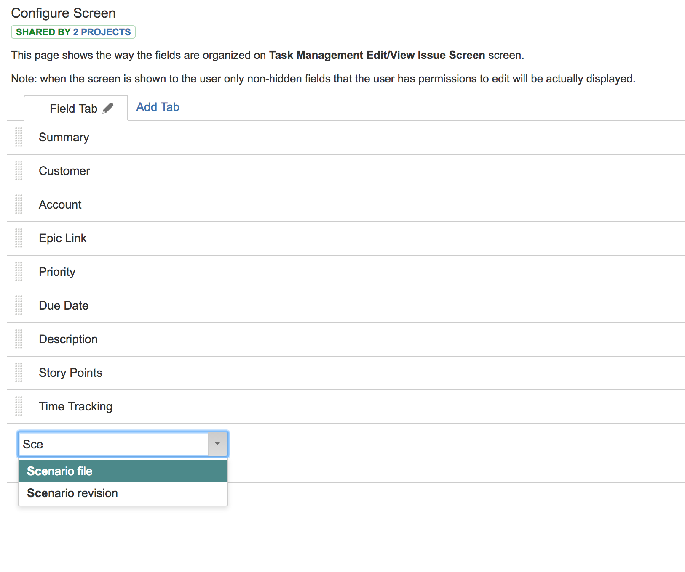
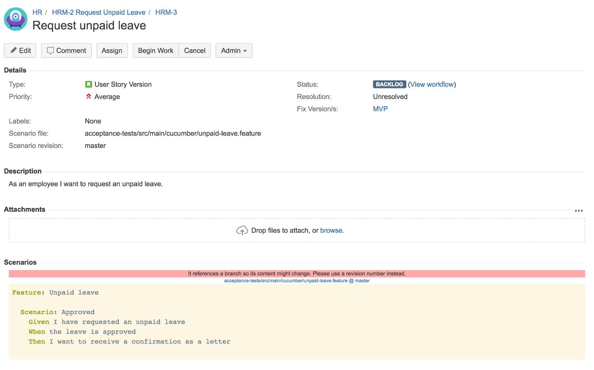

# Scenarios for JIRA Cloud

*Note*: This is no longer supported due to changes in atlassians policies. We are unable to run the addon for you, but you may use our source code freely

Extends Atlassian JIRA Cloud by including gherkin scenarios
from a github or bitbucket repository into the issue view.

## Installation
* Install from the [Atlassian Marketplace](https://marketplace.atlassian.com/plugins/ch.linkyard.scenarios-jira/cloud/overview)
* Setup your project:
  * Go to the administration of your project and open "scenarios integration".
  * Enter the data of the source repositry your gherking (.feature) files are kept in.
  * Make sure to use an application password (bitbucket) or personal security token for security reasons.
    
* Enable the custom fields "scenario file" and "scenario revision" for your Story issue type (or whatever issue type you're using for the scenarios).
  * If your not and experienced JIRA Administrator you can use the "Where is my field?" functionality of JIRA:
  * Open the issue you want to display the scenario on.
  * Click the "Admin" button in the toolbar and select "Where is my field?"
  * Type "Scenario File"
    
  * The dialog will show you where you need to add the field to (refer to the Atlassian JIRA documentation for an explanation).
  * Click "go to 'Task Management Edit/View Issue Screen' Screen configuration settings"
  * Add the "Scenario file" and "Scenario revision" field to the screen
    

## Usage
* Edit an issue and fill the "Scenario file" and "Scenario revision":
  * file: Relative filename of the your .feature file inside your source repository (eg `tests/features/my-feature.feature`)
  * revision: git branch or commit id (sha). If you're not sure about it, then use `master` (usually the default branch in the repository)
  * 
* See your scenario inside your issue:
  

## Security
* this addon reads issue details from Jira
* this addon stores entity properties on the issue:
  * a flag whether the scenario fields are set
* this addon stores entity properties on the project:
  * bitbucket/github repository identification (type, owner, name/slug)
  * bitbucket/github account (user/password). The password is encrypted
    with a key that is stored in the database of the addon.

The JIRA instance never has access to your bitbucket app
password or github token. The same goes for the client (browser) -
except when they configure a new password (only the one they
have typed in the field).

## For Developers
This addon may serve as an example for Atlassian Connect plugins.

It uses the following techniques:

* node.js express based server (atlassian-connect-express)
* embedding a webpanel (`ly-issue-scenarios`) into the view issue screen: `atlassian-connect.json`
* adding a settings screen (`projectconfig-panel`) to the project settings: `atlassian-connect.json`
* reacting to updates to an issue via a webhook: `issue-updated.js` and `atlassian-connect.json`
* adding custom fields to the JIRA instance: `atlassian-connect.json`
* using the JIRA REST API from our server: `jira-connector.js`
* using the JIRA REST API from the webbrowser: `getProjectProperty` in `js/project-config.js`
* using the bitbucket REST API from the server: `bitbucket-connector.js` / github REST API `github-connector.js`
* calling our server from the browser
  * server part: `encrypt` in `routes/project-config.js`
  * client part:
    * `setProjectEntityPropertyEncrypted` in `js/project-config.js`
    * jwt in `page-context.js` and `layout.hbs` (meta tag)
* storing settings in JIRA as entity properties
  * server part (reading): `loadSettings` in `jira-connector.js`
  * client part (reading and writing): `js/project-config.js`
* storing sensitive data: see the handling of the password entity property (above)
  * server generates unique encryption key per tenant and stores it in its database
  * the encrypted passwords are stored as entity properties in JIRA
  * they can only be decrypted by the server and not in the browser
* deployment using docker: `Dockerfile`

## Development
To develop and test with this plugin on you local macheinge:

* Sign-up for an [development cloud instance](https://developer.atlassian.com/static/connect/docs/latest/guides/development-setup.html)
* Copy `credentials.json.sample` to `credentials.json` and add your credentials from the previous step
* Start the server using `npm start`
* It'll add the plugin to your developement JIRA instance. If it does not you can manually add it in the plugin manager
  using the ngrok url shown at the startup (i.e. `Local tunnel established at https://fb33e879.ngrok.io/`)
